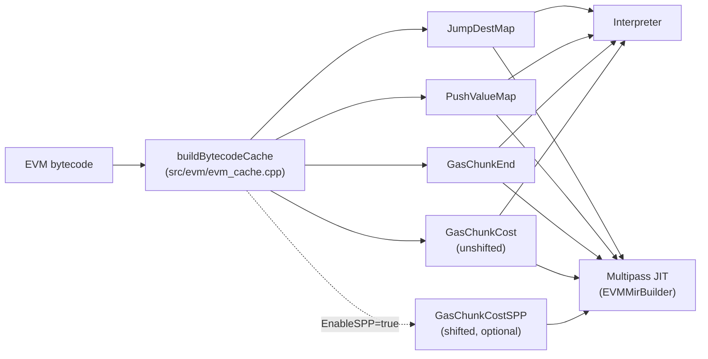
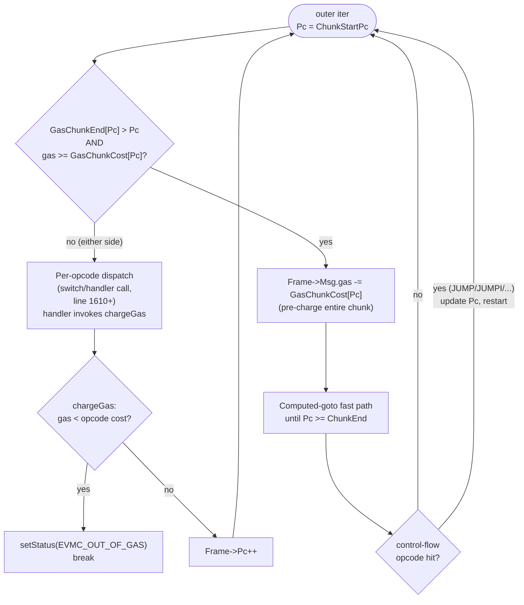
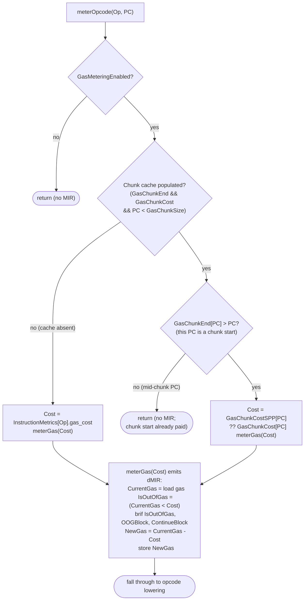
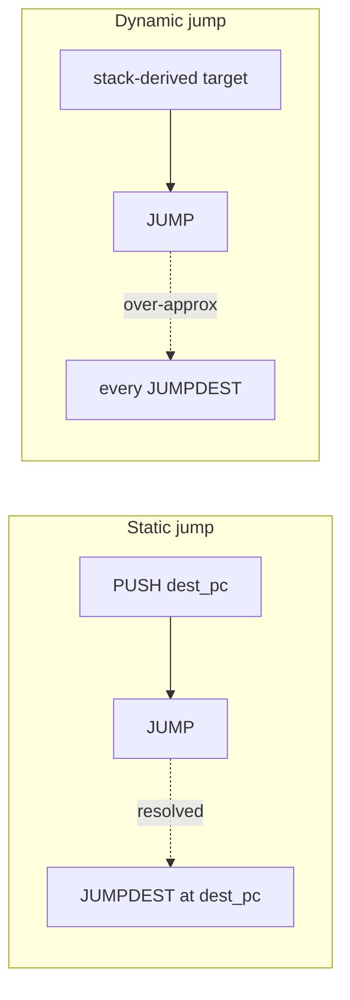
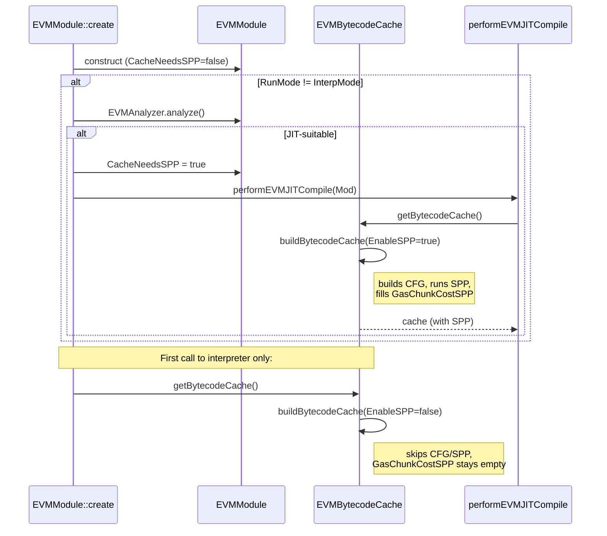

# EVM Gas Mechanism (Interpreter and JIT)

This document describes how DTVM accounts for EVM gas in both the
interpreter and the multipass JIT, and how the SPP (Structured
Precharging Pass) shifts charges along the control-flow graph for the
JIT consumer while keeping the interpreter's per-block totals
unchanged.

## Goals

- Charge each EVM execution path the exact gas the spec requires.
- Detect Out-Of-Gas (OOG) before any state change occurs.
- Amortize the per-opcode "is there enough gas?" check across
  straight-line code so the hot path reduces to one comparison per
  basic block (interpreter) or per chunk start (JIT).

## Shared data: the bytecode cache

Both execution engines read from a single
`zen::evm::EVMBytecodeCache` (`src/evm/evm_cache.h`). The cache is
built lazily on first access — `EVMModule::initBytecodeCache` is
defined at `src/runtime/evm_module.cpp:133-136`; the SPP-gating site
that flips `CacheNeedsSPP` lives at `src/runtime/evm_module.cpp:117`.
The cache exposes five parallel arrays indexed by program counter
(PC):

| Field            | Indexed by | Meaning                                                                                 |
| ---------------- | ---------- | --------------------------------------------------------------------------------------- |
| `JumpDestMap`    | PC         | 1 if a `JUMPDEST` opcode begins at this PC, else 0.                                     |
| `PushValueMap`   | PC         | The 256-bit immediate decoded from a `PUSH*` at this PC (otherwise 0).                  |
| `GasChunkEnd`    | chunk-start PC | Exclusive end PC of the gas chunk that starts here. Zero for non-chunk-start PCs.  |
| `GasChunkCost`   | chunk-start PC | **Unshifted** sum of opcode gas costs in the chunk (interpreter consumer).         |
| `GasChunkCostSPP`| chunk-start PC | **SPP-shifted** chunk cost (JIT consumer). Empty when SPP is disabled for this module. |

A "gas chunk" is a maximal straight-line region whose static gas
cost can be summed once at chunk construction. It ends at any
**gas-chunk terminator** (`isGasChunkTerminator` at
`src/evm/evm_cache.cpp:41-62`): the control-flow exits
`STOP`/`RETURN`/`REVERT`/`SELFDESTRUCT`/`INVALID`/`JUMP`/`JUMPI` and
the gas-sensitive opcodes
`SSTORE`/`CALL`/`CALLCODE`/`DELEGATECALL`/`STATICCALL`/`CREATE`/
`CREATE2`/`GAS`. The terminator is **inside** its chunk — its static
cost is included in `GasChunkCost` (`evm_cache.cpp:329`) and a fresh
chunk starts at the *next* PC (`evm_cache.cpp:291-296`). A chunk also
ends just before a `JUMPDEST` (since `JUMPDEST` itself begins a new
chunk) and at the end of the bytecode.



The two consumers read disjoint chunk-cost arrays so neither
perturbs the other. Concretely:

- The interpreter reads only `GasChunkCost` (`src/evm/interpreter.cpp:382`).
- The JIT prefers `GasChunkCostSPP` when non-null and falls back to
  `GasChunkCost` otherwise (`src/compiler/evm_frontend/evm_mir_compiler.cpp:534, 578, 1315`).

## Interpreter mode

The interpreter runs the dispatch loop in
`BaseInterpreter::interpret` (`src/evm/interpreter.cpp:362`). Each
outer iteration starts at `Frame->Pc` and tries the **chunk fast
path** first:



Key properties:

- Inside a chunk, **no gas check happens per opcode** — the chunk's
  total has already been deducted at the chunk start. The
  computed-goto loop simply executes opcodes, advances `Pc`, and
  checks `Pc >= ChunkEnd` to exit
  (`DISPATCH_NEXT` macro at `src/evm/interpreter.cpp:525`).
- Opcodes whose behaviour depends on `gas_left` at runtime
  (`SSTORE`, `CALL*`, `CREATE*`, `GAS`) are gas-chunk terminators —
  each is the **last** opcode of its chunk, so the chunk's static
  pre-charge has been applied before the handler runs and any
  dynamic delta the handler charges (via `chargeGas` at
  `src/evm/interpreter.cpp:33-50`) is layered on top of an accurate
  `gas_left` value.
- Memory expansion is **not** a chunk boundary: opcodes that touch
  memory (`MLOAD`, `MSTORE`, `MSTORE8`, `KECCAK256`, the various
  `*COPY` opcodes, `RETURN`, `REVERT`, …) charge their dynamic
  expansion delta inline by calling `expandMemoryAndChargeGas`
  (`src/evm/opcode_handlers.cpp:261`) from within the handler.
- The interpreter intentionally consumes the **unshifted** cost
  (PR #371). The cache must keep an unshifted column available
  regardless of whether SPP runs.

## Multipass JIT mode

The JIT lowers EVM bytecode to dMIR via `EVMMirBuilder`
(`src/compiler/evm_frontend/evm_mir_compiler.{h,cpp}`). Gas accounting
is woven into MIR generation by two helpers:

- `meterOpcode(Opcode, PC)` — emit the gas check for one opcode at
  `PC` (`src/compiler/evm_frontend/evm_mir_compiler.cpp:524`).
- `meterOpcodeRange(StartPC, EndPCExclusive)` — emit the gas check
  for a contiguous PC range, used by the JUMPDEST run optimization
  (`src/compiler/evm_frontend/evm_mir_compiler.cpp:544`).

Both ultimately call `meterGas(Cost)` to emit the actual dMIR
sequence (`src/compiler/evm_frontend/evm_mir_compiler.cpp:607`,
short-circuits when `GasCost == 0` at line 608):



Two consequences:

1. The JIT emits **at most one gas check per chunk** — the call at
   the chunk-start opcode covers every opcode up to (but not
   including) the next chunk start. Calls at mid-chunk PCs see
   `GasChunkEnd[PC] == 0` and return without emitting any MIR
   (`evm_mir_compiler.cpp:529, 537`). The fast path at line 553-572
   in `meterOpcodeRange` consumes a precomputed
   `JumpDestRunLastPC`/`JumpDestRunSkipCost` table; the table itself
   is populated when the JUMPDEST run jump-table is materialized
   (`evm_mir_compiler.cpp:1297-1335`), so dispatching across a run
   of consecutive `JUMPDEST`s costs one `meterGas` call.
2. The OOG branch is shared across all gas checks in the function
   via `getOrCreateExceptionSetBB(ErrorCode::GasLimitExceeded)`,
   keeping the cold path out of the hot block layout
   (`evm_mir_compiler.cpp:626, 663`).

When the build is configured with `ZEN_ENABLE_EVM_GAS_REGISTER`, the
gas value lives in a virtual register (`GasRegVar`,
`evm_mir_compiler.cpp:614-642`) instead of being reloaded from
memory on every `meterGas`. Synchronization back to `EVMInstance`
happens at any host-call boundary that may read or update gas —
not just `CALL*`/`CREATE*`/return, but also runtime helpers such as
the balance/code/keccak/memory-load handlers (`syncGasToMemory`
calls at `evm_mir_compiler.cpp:3556, 3623, 3638, 3652, 3745, 3776,
3857, 3976, 4054, 4136`; `syncGasToMemoryFull` is invoked at module
return / `RETURN` / `REVERT` / `STOP` /
`SELFDESTRUCT` paths around lines 1246, 4167-4259).

## SPP cost shifting

The Structured Precharging Pass — implemented as `lemma614Update` in
`src/evm/evm_cache.cpp:919` — moves gas costs **backwards** along the
CFG. For each non-cycle node, it charges the minimum successor cost
upfront, so the consumer only pays the residual at runtime:

```
                 Block A (cost = 3)
                /                \
       Block B (5)            Block C (7)

After SPP (min successor = 5 charged at A):

                 Block A' (cost = 3 + 5 = 8)
                /                \
       Block B' (0)           Block C' (2)
```

(The diagram assumes B and C each have only A as predecessor and
neither ends with a gas-chunk terminator — `lemma614Update` only
shifts when those preconditions hold; see the
`effectivePredCount == 1` and `isGasChunkTerminator` guards at
`evm_cache.cpp:940, 944, 966`.)

Per-path totals are preserved: A→B is `3+5 = 8` before and
`8+0 = 8` after; A→C is `3+7 = 10` before and `8+2 = 10` after. The
benefit is that B's chunk now starts with cost zero, which lets
`meterGas` short-circuit and emit no dMIR at all
(`evm_mir_compiler.cpp:608`), and C's chunk only needs to charge the
residual `2`. The JIT therefore emits fewer non-trivial gas checks
on the hot path and shrinks the OOG fan-out.

Soundness on cycles: the shift never crosses back-edges or
gas-chunk terminators (`SSTORE`/`CALL*`/`CREATE*`/`GAS`), so dynamic
gas is always charged at the correct point
(`evm_cache.cpp:421-427, 919-960`).

### Why a separate `GasChunkCostSPP` array

The interpreter's chunk fast path was specified against the
**unshifted** per-block cost in PR #371 and the cache must continue
to honour that contract. To enable SPP for the JIT without
disturbing the interpreter, the cache exposes two parallel arrays:

- `GasChunkCost` — unshifted, written from `Blocks[Id].Cost`
  (`evm_cache.cpp:1161`), consumed by the interpreter.
- `GasChunkCostSPP` — shifted, written from the metering function
  `Metering[Id]` (`evm_cache.cpp:1165`), consumed by the JIT.

The shifted variant is sound for the JIT because SPP refuses to
shift cost across **gas-sensitive terminators**: `GAS`, `CALL*`,
`CREATE*` (`isGasSensitiveTerminator` and `isGasChunkTerminator`
checks at `evm_cache.cpp:944, 966`). Each of these opcodes ends its
own chunk, so by the time it executes the chunk's cost — shifted or
not — has already been deducted at the chunk-start `meterGas`, and
the value the opcode reads (e.g. `GAS`) reflects the spec-mandated
remaining gas. Cost from the *successor* chunk never leaks back
across the terminator.

### Mixed-precision CFG

The SPP pass needs a sound CFG to compute "minimum successor cost"
correctly:



- `PUSH n; JUMP` resolves to a single edge to `JUMPDEST` at PC `n`
  (`resolveConstantJumpTarget` in `evm_cache.cpp`).
- Every other dynamic `JUMP` gets edges to **all** `JUMPDEST`
  blocks (`buildCFGEdges`, `evm_cache.cpp:386-429`).

Narrowing dynamic-jump edges using partial call-site information
would under-approximate the CFG and let SPP shift charges along
runtime-impossible edges, which breaks the per-path total invariant.
The over-approximation is intentional and documented inline
(`evm_cache.cpp:419-427`).

## Pipeline gating

The SPP CFG construction and shifting pass is significant compile-
time work and is only useful for the JIT consumer. Interpreter-only
modules skip it via `EVMModule::CacheNeedsSPP`:



`evm_compiler.cpp` passes `nullptr` for the SPP pointer when the
array is empty
(`src/compiler/evm_compiler.cpp:70-74`), so a JIT compilation that
runs without SPP (e.g. JIT bypass paths) cleanly falls back to the
unshifted array and remains correct.

## Failure mode summary

| Trigger                                                       | Where                                                              | Result                                       |
| ------------------------------------------------------------- | ------------------------------------------------------------------ | -------------------------------------------- |
| Interpreter, gas insufficient for full chunk pre-charge       | Combined check at `interpreter.cpp:397-398`                        | Skip fast path; fall through to slow path    |
| Interpreter slow path, gas < per-opcode cost                  | `chargeGas` at `interpreter.cpp:33-50`                             | `setStatus(EVMC_OUT_OF_GAS)`, exit outer loop |
| JIT chunk-start `meterGas`, gas < `Cost`                      | `meterGas` `IsOutOfGas` branch (`evm_mir_compiler.cpp:622-631`)    | Branch to shared `OutOfGasBB`                 |
| JIT mid-chunk per-opcode `meterGas`, gas < `Cost`             | Same code path, just smaller `Cost`                                 | Same shared `OutOfGasBB`                      |
| Dynamic-cost opcode (`SSTORE`/`CALL*`/`CREATE*`) underpaid    | Forced chunk boundary; charged by handler call                     | Returns OOG status to dispatcher              |

## References

- `src/evm/evm_cache.{h,cpp}` — bytecode cache, CFG construction,
  `buildGasChunksSPP`, `lemma614Update`.
- `src/evm/interpreter.cpp` — chunk fast path (line 395), per-opcode
  `chargeGas` (line 33).
- `src/compiler/evm_frontend/evm_mir_compiler.{h,cpp}` —
  `meterOpcode`, `meterOpcodeRange`, `meterGas`.
- `src/runtime/evm_module.{h,cpp}` — `CacheNeedsSPP` gating before
  `performEVMJITCompile`.
- `src/compiler/evm_compiler.cpp:70-74` — JIT-side `nullptr` fallback
  for empty `GasChunkCostSPP`.
- `docs/changes/2026-04-05-gas-check-placement/README.md` — design
  notes and benchmark results for the mixed-CFG / dual-array split.
- `docs/modules/evm/spec.md` — module spec for the EVM bytecode cache.
